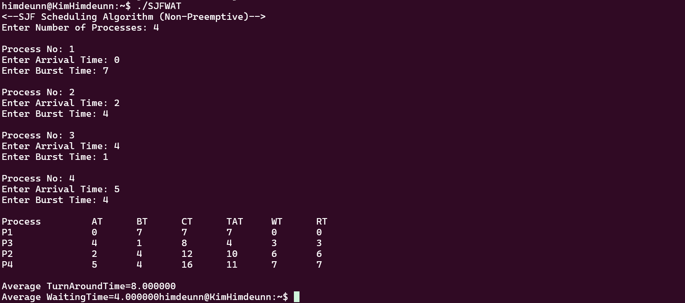

# SJF (Shortest Job First) Non-Preemptive

📌 1. Penjelasan Konsep SJF (Non-Preemptive)
SJF Non-Preemptive adalah algoritma penjadwalan proses yang memilih proses dengan waktu eksekusi terpendek (burst time) dari proses-proses yang telah tiba (arrival time ≤ waktu saat ini). Setelah proses dieksekusi, proses tidak bisa dihentikan hingga selesai.

🧠 2. Input yang Diberikan
Berikut adalah input proses berdasarkan gambar:

| Proses | Arrival Time (AT) | Burst Time (BT) |
| ------ | ----------------- | --------------- |
| P1     | 0                 | 7               |
| P2     | 2                 | 4               |
| P3     | 4                 | 1               |
| P4     | 5                 | 4               |

🛠️ 3. Struktur dan Penjelasan Kode
**a. Struktur `proc`**

```c
struct proc {
  int no, at, bt, it, ct, tat, wt;
};
```

* `no`: Nomor proses
* `at`: Arrival Time
* `bt`: Burst Time
* `it`: Start Time / waktu proses mulai dieksekusi
* `ct`: Completion Time / waktu selesai proses
* `tat`: Turn Around Time = CT - AT
* `wt`: Waiting Time = TAT - BT

**b. Fungsi `read(i)`**
Menginput data arrival dan burst time dari user.

**c. Urutan dan Logika Eksekusi**

**Langkah 1: Input jumlah proses dan datanya**

```c
scanf("%d", &n);
for(int i = 0; i < n; i++) p[i] = read(i+1);
```

**Langkah 2: Sort berdasarkan arrival time**

```c
for(i = 0; i < n-1; i++)
  for(j = 0; j < n-i-1; j++)
    if(p[j].at > p[j+1].at)
      swap(p[j], p[j+1]);
```

**Langkah 3: Jika beberapa proses datang bersamaan, pilih burst time terkecil**

```c
for(j = 1; j < n && p[j].at == p[0].at; j++)
  if(p[j].bt < p[min].bt)
    min = j;
```

**Langkah 4: Proses pertama langsung dijalankan**

```c
p[0].it = p[0].at;
p[0].ct = p[0].it + p[0].bt;
```

**Langkah 5: Untuk proses berikutnya**

```c
for(int i = 1; i < n; i++) {
  for(j = i+1, min = i; j < n && p[j].at <= p[i-1].ct; j++)
    if(p[j].bt < p[min].bt)
      min = j;
  swap(p[i], p[min]);

  if(p[i].at <= p[i-1].ct)
    p[i].it = p[i-1].ct;
  else
    p[i].it = p[i].at;

  p[i].ct = p[i].it + p[i].bt;
}
```

**Langkah 6: Hitung TAT dan WT**

```c
p[i].tat = p[i].ct - p[i].at;
p[i].wt = p[i].tat - p[i].bt;
```

✅ 4. Output Berdasarkan Gambar

| Proses | AT | BT | CT | TAT | WT | RT |
| ------ | -- | -- | -- | --- | -- | -- |
| P1     | 0  | 7  | 7  | 7   | 0  | 0  |
| P3     | 4  | 1  | 8  | 4   | 3  | 3  |
| P2     | 2  | 4  | 12 | 10  | 6  | 6  |
| P4     | 5  | 4  | 16 | 11  | 7  | 7  |

</img>

**Penjelasan:**

* P1 jalan dulu dari 0-7 karena paling awal datang.
* Saat P1 selesai (waktu 7), P2, P3, dan P4 sudah datang.
* Dari P2, P3, dan P4, proses dengan burst time terpendek adalah P3 (1), maka dieksekusi selanjutnya.
* Setelah itu, tinggal P2 dan P4 → P2 (4) dan P4 (4) → karena AT P2 < P4 maka P2 dipilih dulu.
* Terakhir, P4 dijalankan.

📈 5. Rata-rata TAT dan WT

* Average Turn Around Time (TAT) = (7+4+10+11)/4 = 8.00
* Average Waiting Time (WT) = (0+3+6+7)/4 = 4.00

🔄 6. Ringkasan Flow Eksekusi

```cpp
Waktu 0: P1 jalan (BT=7)
Waktu 7: P3, P2, P4 sudah datang → Pilih P3 (BT=1)
Waktu 8: Pilih P2 (BT=4)
Waktu 12: Pilih P4 (BT=4)
Selesai di waktu 16
```

🧾 7. Kesimpulan

* Kode ini mengimplementasikan SJF Non-Preemptive secara benar.
* Proses dengan waktu eksekusi terpendek yang sudah datang akan diprioritaskan.
* Sorting dilakukan dua tahap: berdasarkan arrival time dulu, lalu burst time.
* Menyediakan analisis waktu eksekusi seperti Completion Time, Turn Around Time, dan Waiting Time.
* Cocok untuk memahami dasar algoritma penjadwalan CPU.


🧑‍💻 8. Output Kode

</img>
