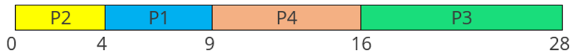

# ANALYSIS ABOUT CODE SJF SCHEDULING ALGORITHMS WITHOUT ARRIVAL TIME 

| NO                   | NAMA                          | NRP                       | KELAS                          |
|----------------------------|--------------------------------------------|-------------------------------------------|-------------------------------------------|
| 1 | TEGAR APRILIAN WIBOWO | 3124500049 | 1 D3 IT B |
| 2 | MUHAMMAD YOGA ANANDA SATRIA  | 3124500039 | 1 D3 IT B |
| 3 | AQILAH SALAMATUDDIN | 3124500054 | 1 D3 IT B |

<br>
<br>
<br>

# Schedulling Algorithms SJF (Shortest Job First) Non-Preemptive

### Tujuan Program

    Menerapkan algoritma penjadwalan SJF (Shortest Job First) Non-Preemptive untuk proses-proses yang 
    tidak memiliki waktu kedatangan (arrival time), hanya memiliki waktu burst time (BT).

### Struktur Data

```c
struct proc {
    int no, bt, ct, tat, wt;
};
```

Struktur proc menyimpan informasi proses:
- no : Nomor proses
- bt : Burst Time
- ct : Completion Time
- tat : Turnaround Time
- wt : Waiting Time


### Table SJF
| Process | BT | CT | TAT | WT | RT |
| ------- | -- | -- | --- | -- | -- |
| P4      | 3  | 3  | 3   | 0  | 0  |
| P1      | 6  | 9  | 9   | 3  | 3  |
| P3      | 7  | 16 | 16  | 9  | 9  |
| P2      | 8  | 24 | 24  | 16 | 16 |

## Analisa dengan data pada Artikel 1

## Artikel 1: SJF Scheduling Program in C

### Problem Description:

Tulislah program penjadwalan SJF dalam bahasa C untuk menentukan waktu tunggu rata-rata dan waktu penyelesaian rata-rata dari sejumlah proses dan waktu burst-nya.

### Algoritma Penjadwalan SJF:

Algoritma SJF (Shortest Job First) memberikan CPU kepada proses dengan waktu eksekusi terkecil.

SJF dapat menggunakan penjadwalan preemptive dan non-preemptive. Versi preemptive disebut SRTF (Shortest Remaining Time First). Di sini kita akan membahas SJF non-preemptive.

### Keunggulan SJF:

* Waktu tunggu minimum dibanding algoritma lain
* Proses dengan burst time besar bisa mengalami starvation, namun dapat diatasi dengan Aging
* Algoritma greedy dan memberikan hasil optimal

### Solusi Masalah:

1. Masukkan jumlah proses
2. Masukkan burst time untuk setiap proses
3. Urutkan proses berdasarkan burst time
4. Hitung waktu tunggu (WT) setiap proses
5. Proses pertama: WT = 0
6. Proses ke-i: WT = jumlah burst time proses sebelumnya
7. Hitung turnaround time = WT + BT
8. Hitung rata-rata WT dan TAT

### Contoh SJF:

| Process | Arrival Time | Burst Time |
| ------- | ------------ | ---------- |
| P1      | 0            | 5          |
| P2      | 0            | 4          |
| P3      | 0            | 12         |
| P4      | 0            | 7          |

**Waiting Time:**

* P1: 4
* P2: 0
* P3: 16
* P4: 9

**Average WT:** (4 + 0 + 16 + 9)/4 = 7.25

**Turnaround Time:**

* P1: 9
* P2: 4
* P3: 28
* P4: 16

**Average TAT:** 14.25

### Gantt Chart

</img>

### Source Code:

```c
#include<stdio.h>

int main() {
    int bt[20],p[20],wt[20],tat[20],i,j,n,total=0,totalT=0,pos,temp;
    float avg_wt,avg_tat;

    printf("Enter number of process:");
    scanf("%d",&n);

    printf("\nEnter Burst Time:\n");
    for(i=0;i<n;i++) {
        printf("p%d:",i+1);
        scanf("%d",&bt[i]);
        p[i]=i+1;
    }

    for(i=0;i<n;i++) {
        pos=i;
        for(j=i+1;j<n;j++) {
            if(bt[j]<bt[pos])
                pos=j;
        }
        temp=bt[i]; bt[i]=bt[pos]; bt[pos]=temp;
        temp=p[i]; p[i]=p[pos]; p[pos]=temp;
    }

    wt[0]=0;
    for(i=1;i<n;i++) {
        wt[i]=0;
        for(j=0;j<i;j++)
            wt[i]+=bt[j];
        total+=wt[i];
    }

    avg_wt=(float)total/n;
    printf("\nProcess\t Burst Time \tWaiting Time\tTurnaround Time");
    for(i=0;i<n;i++) {
        tat[i]=bt[i]+wt[i];
        totalT+=tat[i];
        printf("\np%d\t\t %d\t\t %d\t\t\t%d",p[i],bt[i],wt[i],tat[i]);
    }
    avg_tat=(float)totalT/n;
    printf("\n\nAverage Waiting Time=%f",avg_wt);
    printf("\nAverage Turnaround Time=%f",avg_tat);
}
```

### Penjelasan:

* Menginisialisasi array untuk PID, burst time
* Meminta input jumlah proses dan burst time
* Mengurutkan proses berdasarkan burst time
* Menghitung waktu tunggu dan turnaround time
* Menampilkan hasil dalam bentuk tabel
* Menghitung dan mencetak rata-rata waktu tunggu dan turnaround

### Kompleksitas:

* **Waktu:** O(n^2)
* **Ruang:** O(n)

### Uji Coba:

Input:

```
Enter number of process:4
Enter Burst Time:
p1:5
p2:4
p3:12
p4:7
```

Output:

```
Process      Burst Time     Waiting Time    Turnaround Time
p2               4               0                  4
p1               5               4                  9
p4               7               9                  16
p3               12              16                 28
Average Waiting Time=7.250000
Average Turnaround Time=14.250000
```

<br>
<br>

## Artikel 2: Ilustrasi dan Algoritma Tambahan

### Contoh Burst Time:

| Process | Burst Time |
| ------- | ---------- |
| P1      | 4          |
| P2      | 2          |
| P3      | 8          |
| P4      | 1          |
| P5      | 9          |

P4 → P2 → P1 → P3 → P5

### Algoritma

* Fungsi `swap`, `arrangeArrival`, dan `completionTime`
* Gunakan array `mat[6][n]` untuk menyimpan proses dan waktu

### Source Code (C++):

```cpp
#include<iostream>
using namespace std;

void swap(int *a, int *b) {
   int temp = *a; *a = *b; *b = temp;
}

void arrangeArrival(int num, int mat[][3]) {
   for(int i=0; i<num; i++) {
      for(int j=0; j<num-i-1; j++) {
         if(mat[1][j] > mat[1][j+1]) {
            for(int k=0; k<5; k++) {
               swap(mat[k][j], mat[k][j+1]);
            }
         }
      }
   }
}

void completionTime(int num, int mat[][3]) {
   int temp, val;
   mat[3][0] = mat[1][0] + mat[2][0];
   mat[5][0] = mat[3][0] - mat[1][0];
   mat[4][0] = mat[5][0] - mat[2][0];

   for(int i=1; i<num; i++) {
      temp = mat[3][i-1];
      int low = mat[2][i];
      for(int j=i; j<num; j++) {
         if(temp >= mat[1][j] && low >= mat[2][j]) {
            low = mat[2][j];
            val = j;
         }
      }
      mat[3][val] = temp + mat[2][val];
      mat[5][val] = mat[3][val] - mat[1][val];
      mat[4][val] = mat[5][val] - mat[2][val];
      for(int k=0; k<6; k++) {
         swap(mat[k][val], mat[k][i]);
      }
   }
}

int main() {
   int num = 3, temp;
   int mat[6][3] = {1, 2, 3, 3, 6, 4, 2, 3, 4};

   cout<<"Before Arrange...\n";
   cout<<"Process ID\tArrival Time\tBurst Time\n";
   for(int i=0; i<num; i++) {
      cout<<mat[0][i]<<"\t\t"<<mat[1][i]<<"\t\t"<<mat[2][i]<<"\n";
   }
   arrangeArrival(num, mat);
   completionTime(num, mat);

   cout<<"Final Result...\n";
   cout<<"Process ID\tArrival Time\tBurst Time\tWaiting Time\tTurnaround Time\n";
   for(int i=0; i<num; i++) {
      cout<<mat[0][i]<<"\t\t"<<mat[1][i]<<"\t\t"<<mat[2][i]<<"\t\t"<<mat[4][i]<<"\t\t"<<mat[5][i]<<"\n";
   }
}
```

<br>
<br>

## Artikel 3: Konsep dalam CPU Scheduling

### Konsep Utama:

* **Arrival Time:** waktu proses masuk ready queue
* **Burst Time:** waktu eksekusi proses
* **Completion Time:** saat proses selesai
* **Turnaround Time = Completion - Arrival**
* **Waiting Time = Turnaround - Burst**
* **Response Time = Start - Arrival**

### Contoh:

| Process | Arrival Time | Burst Time |
| ------- | ------------ | ---------- |
| P1      | 3            | 3          |
| P2      | 6            | 3          |
| P3      | 0            | 4          |
| P4      | 2            | 5          |

* P3: TAT=4, WT=0, RT=0
* P1: TAT=4, WT=1, RT=1
* P2: TAT=4, WT=1, RT=1
* P4: TAT=13, WT=8, RT=8

### Kesimpulan:

Memahami konsep-konsep ini membantu sistem operasi dalam menyeimbangkan beban kerja dan meningkatkan efisiensi serta respons sistem.


### Gambar Output SJF
</img>
